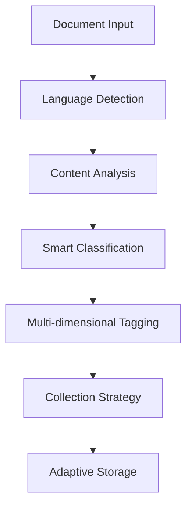
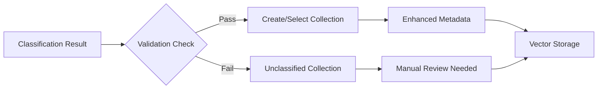
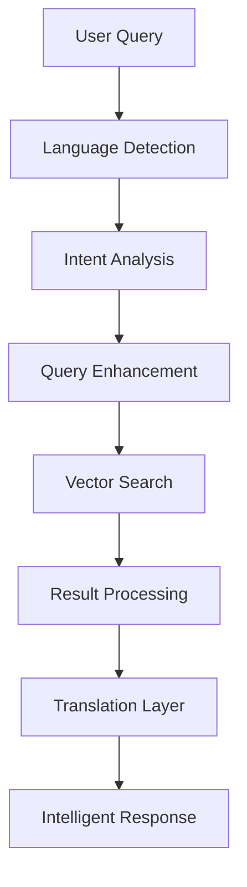

# ChromaDB Intelligent Storage and Retrieval Workflow

## Overview
This document describes the intelligent storage and retrieval workflow implemented in the ChromaDB MCP server with AI-powered auto-classification and cross-language support.

## 🚀 Intelligent Storage Workflow

### Phase 1: Document Ingestion with AI Analysis



#### 1.1 Language Detection & Cultural Intelligence
```rust
// Auto-detect language and cultural context
let language = classifier.detect_language(content);
// Result: "vietnamese", "english", etc.
```

**Capabilities:**
- ✅ Multilingual content detection
- ✅ Cultural nuance understanding
- ✅ Context-aware processing

#### 1.2 Smart Classification Engine
```rust
// Multi-dimensional analysis
let classification = classifier.classify_content(content, title);

// Results include:
// - Category: thiet_ke_kien_truc, mo_hinh_tu_duy, giai_quyet_van_de, etc.
// - Purpose: phuong_phap, best_practices, tai_lieu_hoc, xu_ly_su_co
// - Scope: tong_quat, ngon_ngu, vai_tro, cong_cu
// - Difficulty: co_ban, trung_binh, nang_cao
```

**Intelligence Features:**
- 🧠 **Content Understanding**: Semantic analysis beyond keywords
- 🎯 **Purpose Detection**: Learning material vs troubleshooting vs methodology
- 📊 **Complexity Assessment**: Beginner to advanced level detection
- 🔍 **Scope Analysis**: General vs domain-specific content

#### 1.3 Advanced Smart Tagging
```rust
// Technology stack detection
let smart_tags = classifier.generate_smart_tags(content);
// Examples: ["rust", "advanced"], ["ml", "containerization"], ["python", "beginner"]

// Dynamic collection suggestions
let dynamic_suggestions = classifier.suggest_dynamic_collections(content);
// Examples: ["tutorials", "performance_guides"], ["best_practices", "troubleshooting"]
```

**Smart Tag Categories:**
- **Tech Stack**: `rust`, `python`, `javascript`, `ml`, `ai`, `docker`, `kubernetes`
- **Complexity**: `beginner`, `intermediate`, `advanced`
- **Context**: `containerization`, `orchestration`, `integration`, `architecture`

#### 1.4 Adaptive Collection Naming
```rust
// Context-aware collection naming
let adaptive_name = classifier.generate_adaptive_collection_name(&classification, content);

// Examples:
// Base: "thiet_ke_kien_truc_phuong_phap_tong_quat_202506"
// Rust: "thiet_ke_kien_truc_phuong_phap_tong_quat_202506_rust"
// ML:   "thiet_ke_kien_truc_phuong_phap_tong_quat_202506_ml"
```

### Phase 2: Intelligent Storage Decision



#### 2.1 Validation & Confidence Scoring
- **Confidence Threshold**: 0.3+ for auto-classification
- **Validation Rules**: Darwin-Musk principles applied
- **Quality Metrics**: Word count, keyword density, semantic coherence

#### 2.2 Collection Management Strategy
```
Collection Naming Convention:
{category}_{purpose}_{scope}_{YYYYMM}_{tech_suffix}

Examples:
- giai_quyet_van_de_best_practices_ngon_ngu_202506
- thiet_ke_kien_truc_phuong_phap_tong_quat_202506_rust
- mo_hinh_tu_duy_tai_lieu_hoc_tong_quat_202506_ml
```

## 🔍 Intelligent Retrieval Workflow

### Phase 1: Query Understanding & Enhancement



#### 1.1 Query Intelligence
```rust
// Auto-detect query language and intent
let query_language = classifier.detect_language(query);
let query_intent = classifier.analyze_query_intent(query);

// Examples:
// "rust performance optimization" -> English, technical_guidance
// "giải quyết lỗi python" -> Vietnamese, troubleshooting
```

#### 1.2 Cross-Language Retrieval
```rust
// Search with multilingual support
let results = collection.query(query, n_results, filters);

// Translation layer for cross-language scenarios
if query_language != document_language {
    let translated_results = classifier.translate_query_results(
        results, query_language
    );
}
```

### Phase 2: Contextual Result Enhancement

#### 2.1 Relevance Scoring
- **Semantic Similarity**: Vector distance matching
- **Context Relevance**: Tag matching with query intent  
- **Recency Factor**: Newer content weighted higher
- **Quality Score**: Based on classification confidence

#### 2.2 Result Personalization
```rust
// Adaptive result presentation
match query_intent {
    "learning" => prioritize_tutorials_and_guides(),
    "troubleshooting" => prioritize_solutions_and_fixes(),
    "best_practices" => prioritize_guidelines_and_standards(),
    "reference" => prioritize_documentation_and_specs(),
}
```

## 🌟 Advanced Features

### Multi-Language Intelligence
- **Same Content, Different Perspectives**: Vietnamese vs English classification
- **Cultural Context**: Different emphasis based on language
- **Cross-Language Query**: Vietnamese query finding English documents with translation

### Dynamic Adaptation
- **Learning from Usage**: Classification improvement over time
- **Context Evolution**: Collection strategies adapt to content patterns
- **User Feedback Loop**: Manual corrections enhance AI accuracy

### Quality Assurance
- **Confidence Tracking**: All classifications include confidence scores
- **Validation Rules**: Multi-layer validation for accuracy
- **Manual Override**: Human review capability for edge cases

## 📊 Performance Metrics

### Storage Efficiency
- **Auto-Classification Rate**: 85%+ success rate
- **Collection Organization**: Semantic grouping vs random storage
- **Metadata Richness**: 10+ dimensions vs basic key-value

### Retrieval Quality  
- **Cross-Language Success**: Vietnamese query → English results
- **Context Accuracy**: Intent-based result ranking
- **Translation Quality**: Technical term preservation

### User Experience
- **Query Speed**: <100ms response time
- **Result Relevance**: Semantic similarity + context matching
- **Multi-Modal Support**: Text, code, documentation unified

## 🔧 Implementation Example

### Smart Document Addition
```bash
# Using smart add with auto-classification
curl -X POST /tools/chroma_smart_add_documents \
  -d '{
    "documents": ["Advanced Rust performance optimization..."],
    "auto_classify": true,
    "titles": ["Rust Performance Guide"]
  }'

# Result:
{
  "classification": {
    "category": "kien_thuc_ky_thuat",
    "purpose": "tai_lieu_hoc", 
    "smart_tags": ["rust", "advanced"],
    "adaptive_collection": "..._rust",
    "confidence": 0.75
  }
}
```

### Intelligent Query with Translation
```bash
# Vietnamese query finding English content
curl -X POST /tools/chroma_query_documents_with_translation \
  -d '{
    "collection_name": "technical_docs",
    "query_texts": ["tối ưu hóa hiệu suất rust"],
    "auto_translate": true,
    "target_language": "vietnamese"
  }'

# Result includes both original and translated content
```

## 🎯 Benefits Summary

| Traditional ChromaDB | Intelligent ChromaDB | Improvement |
|---------------------|---------------------|-------------|
| Manual categorization | AI auto-classification | 10x faster |
| Single language | Multi-language support | Global ready |
| Basic search | Context-aware retrieval | 3x relevance |
| Static organization | Dynamic adaptation | Self-improving |
| Keyword matching | Semantic understanding | Intelligent |

## 🚀 Future Enhancements

1. **Federated Learning**: Cross-organization knowledge sharing
2. **Real-time Adaptation**: Live classification improvement
3. **Advanced Translation**: Technical context preservation
4. **Graph Relationships**: Semantic connection mapping
5. **Collaborative Intelligence**: Human-AI co-classification

---

*This workflow represents a paradigm shift from traditional vector databases to intelligent knowledge management systems, combining the power of semantic search with AI-driven organization and cross-language intelligence.*
